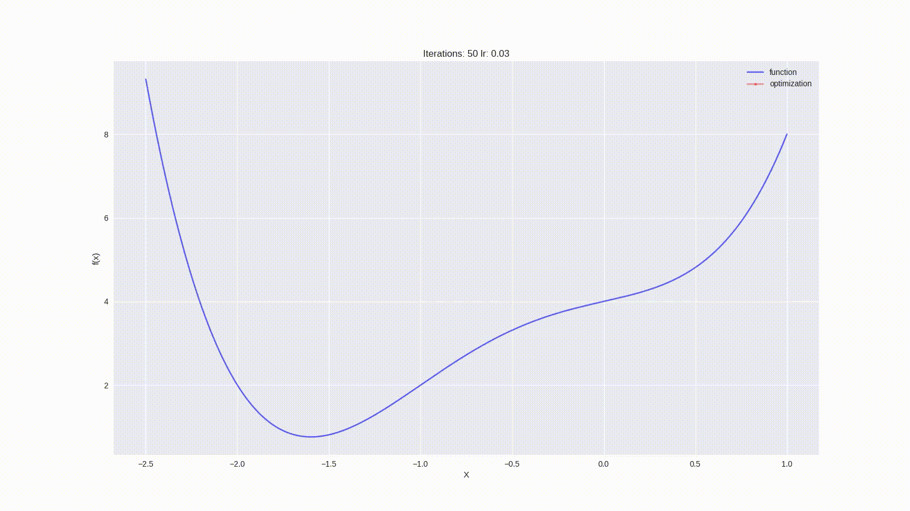
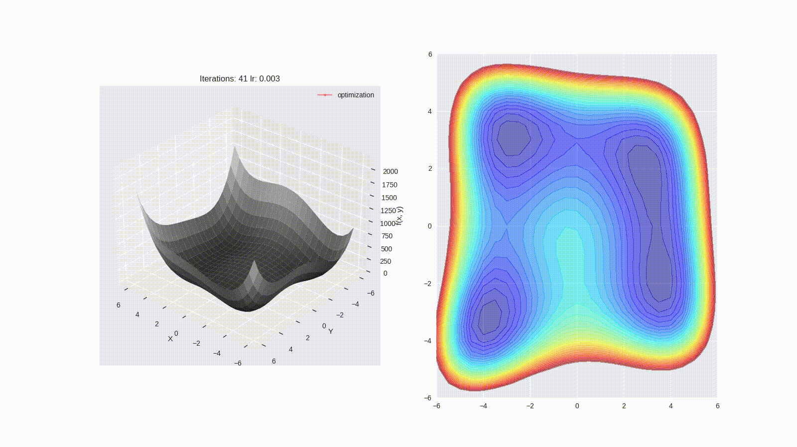
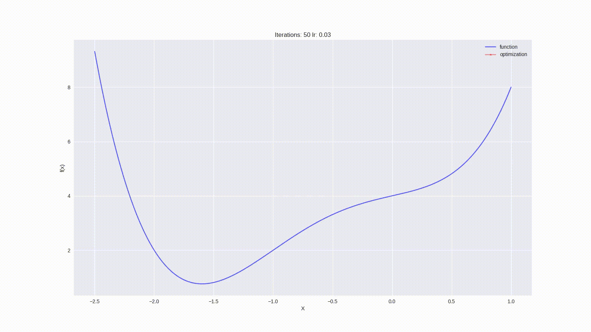
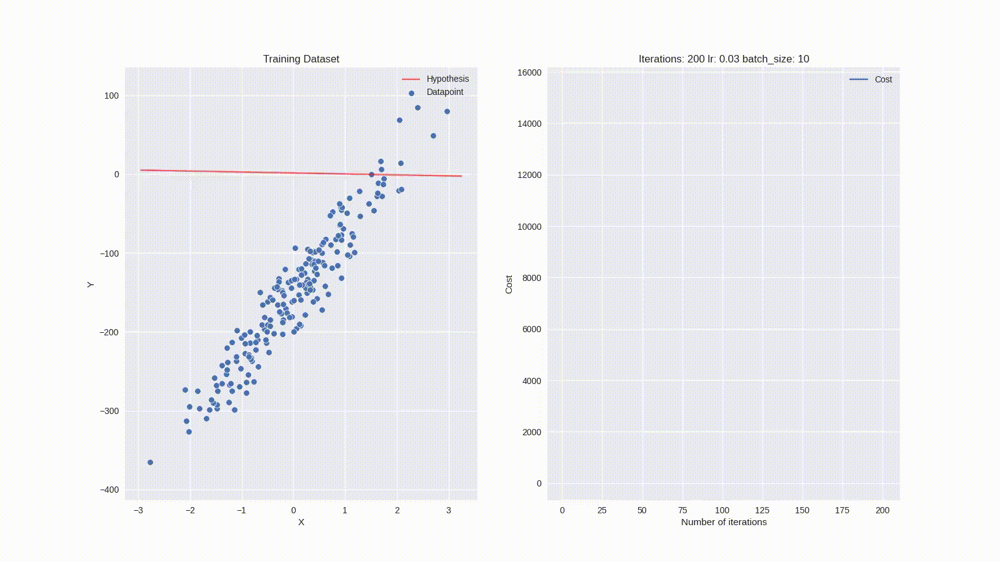
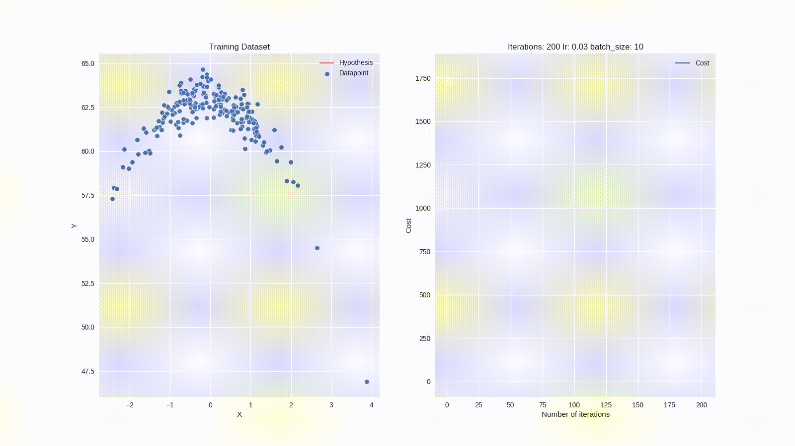
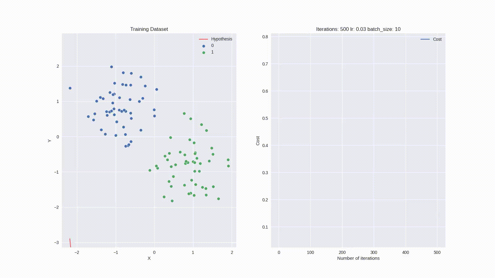
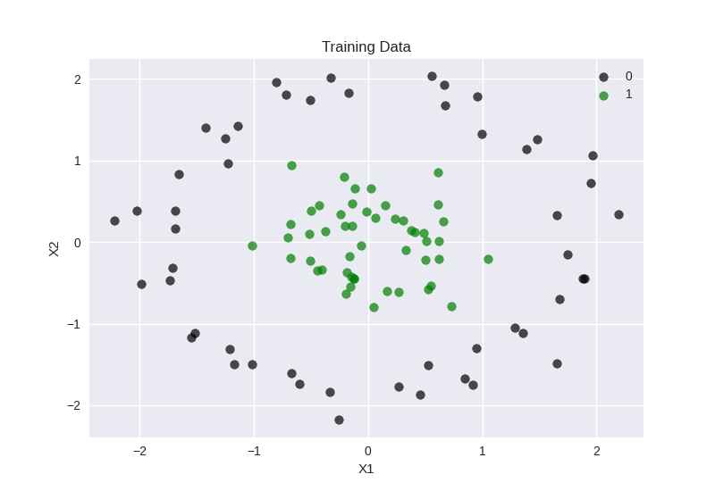
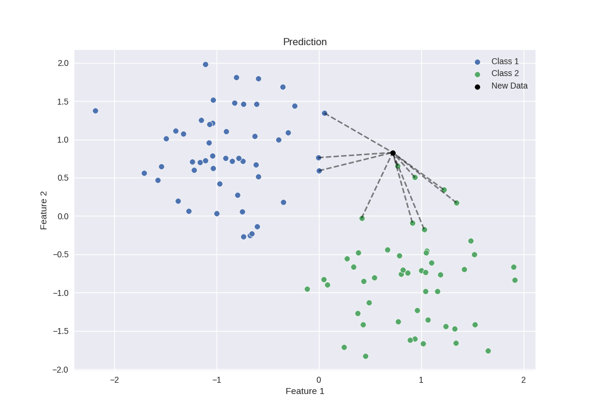
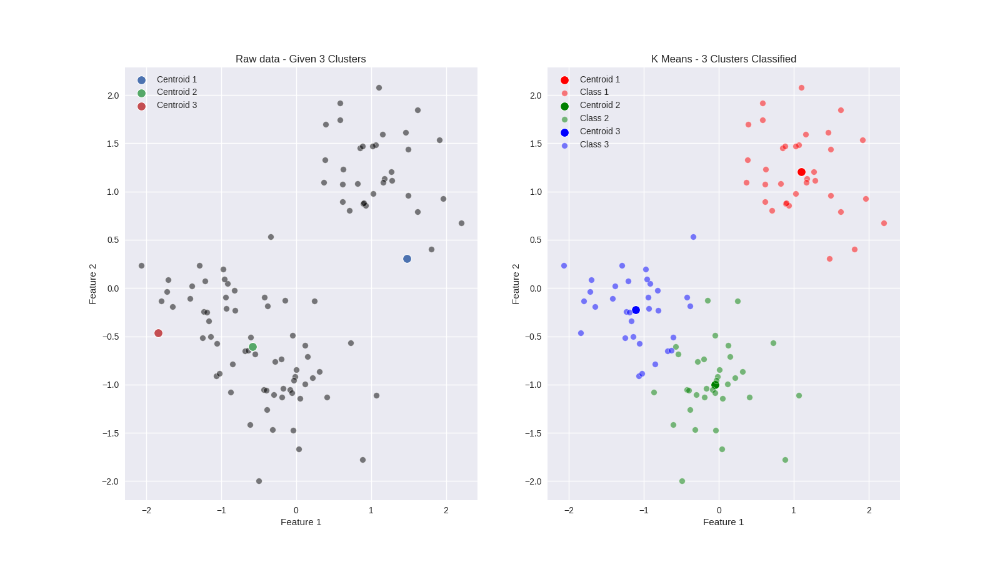

# Machine Learning Algorithms

Implementation of different machine learning algorithms written in Python.

## Contents

- [Installation](#installation-of-libraries)
- [Usage](#usage)
- [Summary](#summary)
- [Algorithms and Visualizations](#algorithms-and-visualizations)
- [Links](#links)
- [Citations](#citations)
- [TODO](#todos)

## Installation of libraries

`pip install -r requirements.txt`

> NOTE: scikit-learn module is used only for accessing the datasets and scalers.

## Usage

`python run_{algorithmToRun}.py`

> NOTE: All scripts have additional command arguments that can be given by the user.

`python run_{algorithmToRun}.py --help`

## Summary

This project was initially started to help understand the math and intuition behind different ML algorithms, and why they work or don't work, for a given dataset. I started it with just implementing different versions of gradient descent for Linear Regression. I also wanted to visualize the training process, to get a better intuition of what exactly happens during the training process. Over the course of time, more algorithms and visualizations have been added.

## Algorithms and Visualizations

### Gradient Descent 2D

### Gradient Descent 3D

### Gradient Descent with **LARGE** Momentum 2D

### Gradient Descent with **LARGE** Momentum 3D

> NOTE: Large value of momentum has been used to exaggerate the effect of momentum in gradient descent, for visualization purposes. The default value of momentum is set to 0.3, however 0.75 and 0.8 was used in the visualization for 2D and 3D respectively.

### Linear Regression

### Linear Regression for a non-linear dataset

This was achieved by adding polynomial features.

### Logistic Regression

### Logistic Regression for a non-linear dataset

This was achieved by adding polynomial features.

### K Nearest Neighbors 2D

### K Nearest Neighbors 3D

### KMeans 2D

### KMeans 3D

## Links

Link to first Reddit [post](https://www.reddit.com/r/Python/comments/gns9rb/linear_regression_using_gradient_descent_3_types/?utm_source=share&utm_medium=web2x&context=3)

Link to second Reddit [post](https://www.reddit.com/r/Python/comments/n31by9/visualization_of_ml_algorithms/)

## Citations

Sentdex: [ML from scratch](https://youtube.com/playlist?list=PLQVvvaa0QuDfKTOs3Keq_kaG2P55YRn5v)

Coursera Andrew NG: [Machine Learning](https://www.coursera.org/learn/machine-learning?)

## Todos

- SVM classification, gaussian kernel
- Mean Shift
- PCA
- DecisionTree
- Neural Network
